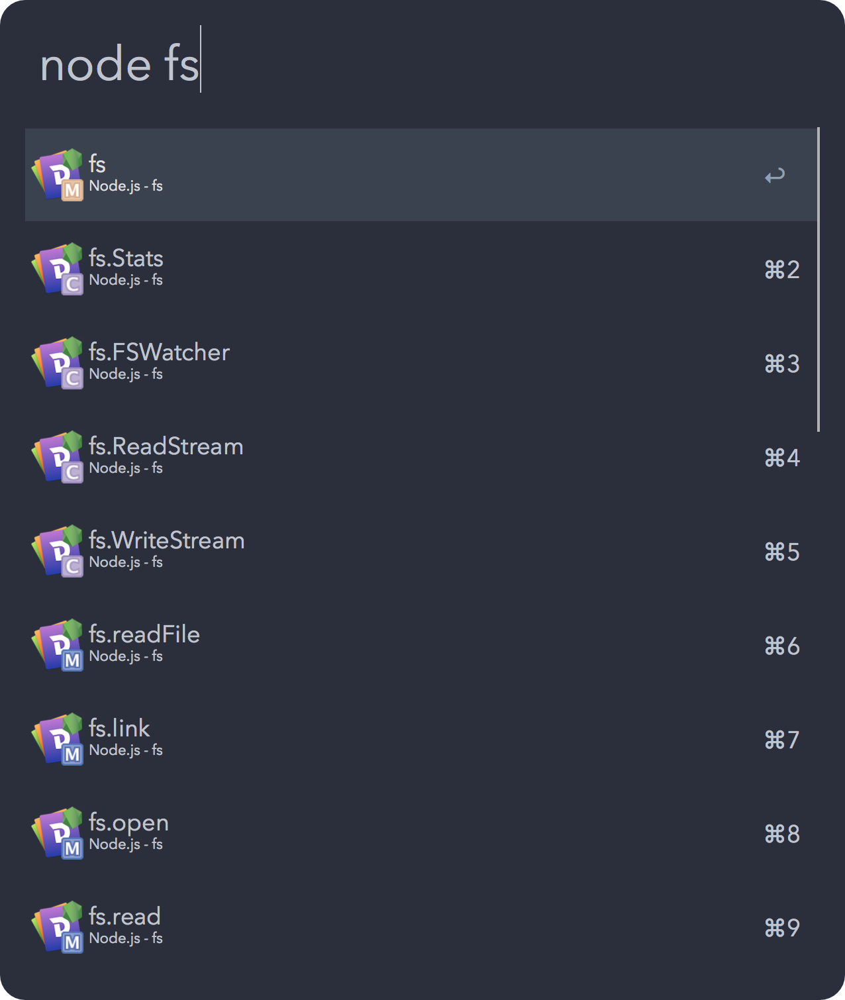

# bliss-alfred
[Bliss](https://github.com/saadq/bliss-ui) is a modified version of [base16-ocean](https://github.com/chriskempson/base16-vim/blob/master/colors/base16-ocean.vim). This is a port of it for Alfred.

## Installation
1. Go to [this](https://www.alfredapp.com/extras/theme/M9GODVM8PZ/) link.
2. Click <kbd>Open theme in Alfred 3</kbd>
3. Click <kbd>import</kbd>

## License
MIT
